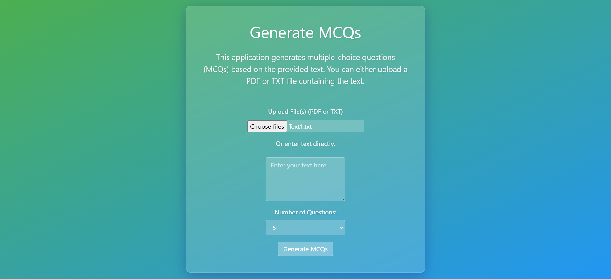
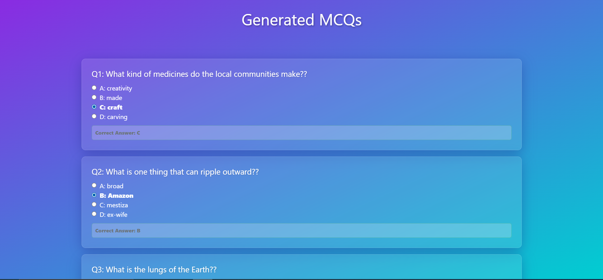

# MCQ Generator

## Project Overview


The MCQ Generator is a web application designed to create multiple-choice questions (MCQs) automatically from provided text. Users can either upload PDF or TXT files, or directly input text, and the application will generate a specified number of MCQs with options and a correct answer. This tool leverages advanced Natural Language Processing (NLP) models to ensure the generated questions and distractors are relevant and high-quality.

The application uses a Flask backend for handling requests and serving web pages. It integrates several powerful Python libraries and pre-trained models for its core functionality:
- **SpaCy**: For robust natural language processing, including sentence segmentation and entity extraction.
- **Hugging Face Transformers (T5-base finetuned for question generation)**: To generate questions from a given context and answer.
- **Sentence-Transformers (paraphrase-MiniLM-L6-v2)**: For semantic similarity calculations, crucial for generating high-quality distractors.
- **NLTK (WordNet)**: To find synonyms and related words for distractors, enhancing their quality.
- **PyPDF2**: For extracting text content from PDF documents.
- **Flask-Bootstrap**: For quick and responsive UI development.

## Screenshots


**1. Homepage (Input Interface)**


**2. Generated MCQs (Before showing results)**


**3. Generated MCQs (After showing results)**


## Demo Video

Watch a quick demo of the MCQ Generator in action:
**[MCQ Generator Demo](https://youtu.be/U-ORTq0k90g)**


## Features

* **Text Input Options**:
    * Upload one or more PDF files.
    * Upload one or more TXT files.
    * Enter text directly into a textarea.
* **Customizable Question Count**: Choose to generate 5, 10, 15, or 20 MCQs.
* **Intelligent Question Generation**: Utilizes a finetuned T5 model to generate coherent and relevant questions.
* **High-Quality Distractor Generation**: Employs multiple strategies for distractors:
    * Semantic similarity based on context.
    * WordNet-based synonyms and related terms.
    * Contextual nouns from the provided text.
* **Interactive Results Display**: Presents MCQs in a user-friendly format with a "Show Results" button to reveal correct answers.
* **Responsive Design**: Built with Bootstrap for a mobile-first and responsive user interface.
* **Error Handling**: Provides feedback to the user if no text is provided.

## How it Works

The core logic of the MCQ generation is as follows:

1.  **Text Preprocessing**: The input text (from files or direct input) is processed using SpaCy to segment it into sentences and identify relevant entities (PERSON, ORG, GPE, LOC) and nouns.
2.  **Sentence Selection**: Sentences are selected to ensure diversity in questions. The `generate_mcqs` function attempts to pick sentences that are dissimilar to previously used sentences.
3.  **Answer Extraction**: Key entities or important nouns within the selected sentences are identified as potential answers.
4.  **Question Generation**: For each selected sentence and its extracted answer, a pre-trained T5 model (specifically finetuned for question generation) is used to formulate a question.
5.  **Distractor Generation**: The `get_distractors` function generates plausible incorrect options (distractors) using three main strategies:
    * **Semantic Similarity**: Finds words in the context that are semantically similar to the correct answer using sentence embeddings.
    * **WordNet**: Leverages WordNet to find hypernyms, hyponyms, and synonyms of the answer.
    * **Contextual Nouns**: Selects other relevant nouns from the provided text.
    These strategies ensure that distractors are not too obvious or completely unrelated, making the MCQs more challenging and effective.
6.  **MCQ Assembly**: The correct answer and generated distractors are shuffled, and the MCQ is assembled with options labeled A, B, C, D.

## Setup and Installation

To set up and run this project locally, follow these steps:

### 1. Clone the Repository

```bash
git clone https://github.com/Adarsh-S1/MCQ-generator.git
cd mcq-generator

```
### 2.Create a Virtual Environment 
```
python -m venv venv
source venv/bin/activate  # On Windows:`venv\Scripts\activate`
```
### 3. Install Dependencies
```
pip install -r requirements.txt
```
### 4.  Download SpaCy Model
```
python -m spacy download en_core_web_sm
```
### 5.Download NLTK Data
```
import nltk
nltk.download('punkt', quiet=True)
nltk.download('wordnet', quiet=True)
nltk.download('omw-1.4', quiet=True)
```
### 6. 📂 Folder Structure

```
📦project-root/
 ┣ 📜app.py
 ┣ 📜templates/
 ┃ ┣ 📜index.html
 ┃ ┗ 📜mcqs.html
 ┣ 📁static/ (if you have CSS or images)
 ┣ 📄README.md
```

### 6.  Run the Application
```
python app.py
```
## 📄 Example Input Files

You can test the app with:
- `Text1.txt` (Amazon Rainforest Article)
- `Text2.txt` (Gutenberg Printing Press)
- `New Text Document.txt` (Federer vs Nadal Rivalry)